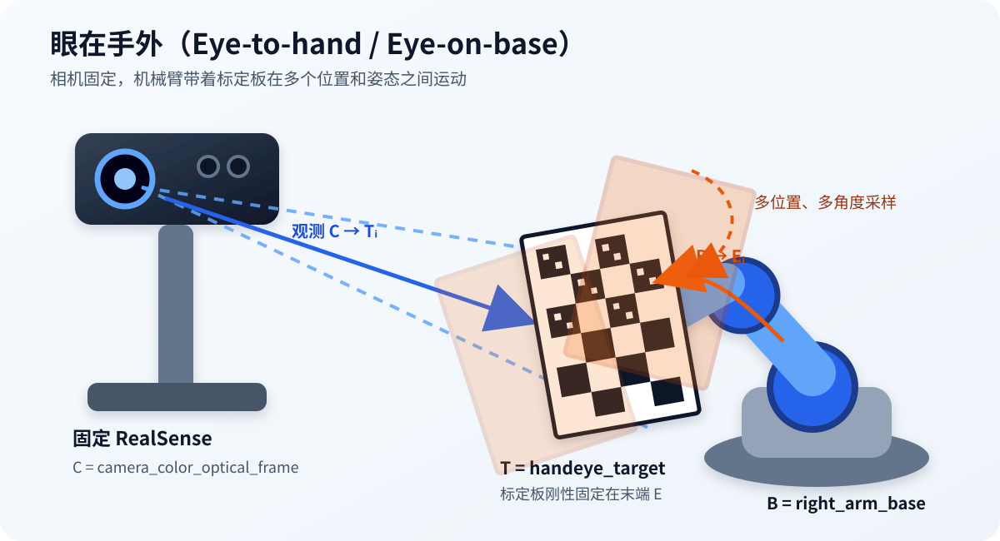
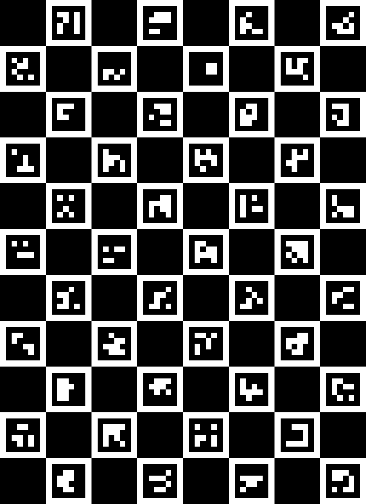
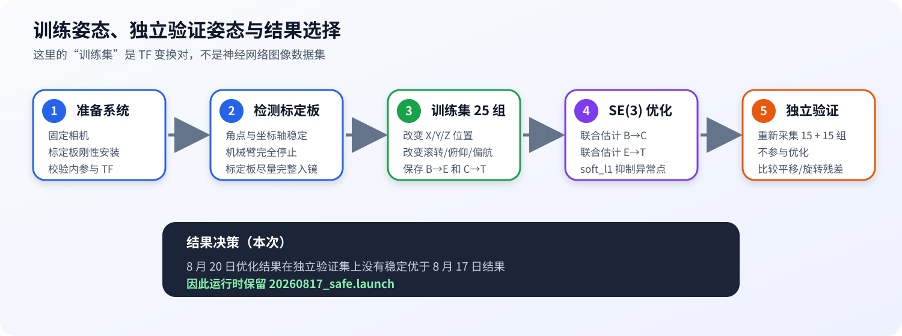

# 右臂 RealSense 眼在手外手眼标定总结

> 更新日期：2026-08-25
> 适用系统：固定 RealSense + 右臂 UR3 + ChArUco 标定板
> 本文中的“训练集/验证集”是不同机械臂姿态下的 TF 变换样本，不是神经网络图像数据集。

## 1. 先说结论：昨天到底使用了哪个？

2026-08-24 实际运行时启动的文件是：

```text
/home/gzu/gzu_ws/calibration/handeye/right_arm_camera_eye_on_base_20260817_safe.launch
```

它使用的标定数据来源是：

```text
/home/gzu/gzu_ws/2026-8-17<0.00929.launch
```

两者的关系是：

```text
2026-8-17<0.00929.launch
        │  8 月 17 日求得的原始 base → color optical 数值
        │  换算为不破坏 RealSense 内部 TF 树的形式
        ▼
right_arm_camera_eye_on_base_20260817_safe.launch
        │  昨天实际启动，发布 right_arm_base → camera_link
        ▼
RealSense 驱动继续发布 camera_link → camera_color_optical_frame
```

因此，最准确的表述是：

- **昨天实际启动** `right_arm_camera_eye_on_base_20260817_safe.launch`。
- **手眼标定数值来源** `2026-8-17<0.00929.launch`。
- **昨天没有使用** 8 月 20 日的 `right_arm_camera_robust_optimized_20260820.yaml`。
- 8 月 20 日的训练集和两个验证集只用于离线优化和对比，运行时不会直接读取它们。

### 1.1 四类文件的用途区分

| 文件 | 作用 | 昨天是否使用 |
|---|---|---:|
| `2026-8-17<0.00929.launch` | 8 月 17 日原始标定数值，直接指向 optical frame | 作为数值来源 |
| `right_arm_camera_eye_on_base_20260817_safe.launch` | 把同一相机位姿安全发布到 `camera_link` | **是，实际启动** |
| `right_arm_camera_train/verify*.yaml` | 采样的 TF 姿态对 | 否，仅离线计算 |
| `right_arm_camera_robust_optimized_20260820.yaml` | 8 月 20 日的候选优化结果 | 否，未切换为运行结果 |

## 2. 眼在手外的安装方式



本系统属于 **Eye-to-hand / Eye-on-base（眼在手外）**：

- RealSense 固定在机械臂外部，采样全程不能移动。
- ChArUco 标定板刚性安装在右臂末端，不能晃动或中途拆装。
- 机械臂带着标定板改变位置和方向，相机在每个姿态下观测标定板。

主要坐标系：

| 含义 | 坐标系 |
|---|---|
| 右臂基座 B | `right_arm_base` |
| 右臂末端 E | `right_arm_tool0` |
| RealSense 彩色光学坐标系 C | `camera_color_optical_frame` |
| ChArUco 标定板 T | `handeye_target` |

每个采样姿态满足：

$$
{}^{B}T_{E_i}\,{}^{E}T_T
=
{}^{B}T_C\,{}^{C}T_{T_i}
$$

未知量为：

- $ {}^{B}T_C $：机械臂基座到相机的变换，即手眼标定结果。
- $ {}^{E}T_T $：末端到标定板的固定安装变换。

## 3. ChArUco 标定板



标定板参数：

| 参数 | 数值 |
|---|---:|
| ChArUco 方格数 | X = 11，Y = 8 |
| 棋盘格边长 | 15 mm |
| ArUco marker 边长 | 11 mm |
| ArUco 字典 | `DICT_4X4_250` |
| 标定区尺寸 | 165 mm × 120 mm |
| MoveIt Calibration `longest board side` | 0.165 m |

打印时使用以下原尺寸 PDF：

- [纯标定板 A4 打印版](../calibration/charuco_print/right_arm_eye_on_base_charuco_A4_11x8_square15mm_marker11mm_DICT_4X4_250_CLEAN_PRINT_ACTUAL_SIZE.pdf)
- [带 100 mm 标尺和 50 mm 检查框的 A4 打印版](../calibration/charuco_print/right_arm_eye_on_base_charuco_A4_11x8_square15mm_marker11mm_DICT_4X4_250_PRINT_ACTUAL_SIZE.pdf)

打印要求：

1. 选择 **Actual size / 实际大小 / 100%**。
2. 禁止 `Fit`、`适应页面`、`缩放到可打印区域`。
3. 用尺子确认 100 mm 标尺实际为 100.0 mm。
4. 将纸张平整粘在刚性平板上，不得翘曲。
5. 标定板安装到末端后，训练集和验证集采集期间不得重新拆装。

## 4. 标定和数据采集流程



### 4.1 启动检测环境

已经单独启动 RealSense、机械臂驱动和 MoveIt 时，使用：

```bash
cd /home/gzu/gzu_ws
source /opt/ros/noetic/setup.bash
source devel/setup.bash

roslaunch vision_pkg eye_to_hand_charuco_8x11_15_11_calibration.launch \
  start_realsense:=false \
  start_robot:=false \
  start_moveit:=true \
  start_rviz:=true \
  start_detection_view:=true
```

RViz 中应确认：

```text
Sensor configuration: Eye-to-hand
Sensor frame: camera_color_optical_frame
Object frame: handeye_target
End-effector frame: right_arm_tool0
Robot base frame: right_arm_base
Target Type: HandEyeTarget/Charuco
```

### 4.2 单个姿态如何采集

1. 手动或通过 MoveIt 将右臂移动到新姿态。
2. 等待机械臂完全停止。
3. 检查图像中的 ChArUco 角点和坐标轴是否稳定。
4. 保证标定板尽量完整入镜，避免强反光、运动模糊和边缘遮挡。
5. 在采集程序中按 Enter。
6. 程序同时读取并保存：
   - `right_arm_base -> right_arm_tool0`
   - `camera_color_optical_frame -> handeye_target`
7. 改变位置和旋转角度后重复采集。

采样点应包含：

- 近、远、左、右、高、低。
- 不同的滚转、俯仰和偏航角。
- 画面中心和画面边缘的可靠检测区域。

不应只让末端平移、不改变姿态，也不应把所有采样点集中在很小的工作区域。

## 5. 训练集的采集

训练集文件：

```text
/home/gzu/gzu_ws/calibration/handeye/right_arm_camera_train_20260820.yaml
```

采集命令：

```bash
/home/gzu/anaconda3/bin/python \
  /home/gzu/gzu_ws/src/dual_arm_tasks/scripts/handeye_eye_on_base_lie_optimizer.py \
  --collect \
  --samples-file /home/gzu/gzu_ws/calibration/handeye/right_arm_camera_train_20260820.yaml \
  --base-frame right_arm_base \
  --tool-frame right_arm_tool0 \
  --camera-frame camera_color_optical_frame \
  --target-frame handeye_target
```

本轮共采集 **25 组**。每组包含：

```yaml
base_to_tool:
  translation: [x, y, z]
  quaternion_xyzw: [qx, qy, qz, qw]
camera_to_target:
  translation: [x, y, z]
  quaternion_xyzw: [qx, qy, qz, qw]
```

实际姿态覆盖大致为：

| 项目 | 范围 |
|---|---:|
| 末端 X | -0.398～-0.174 m |
| 末端 Y | 0.097～0.246 m |
| 末端 Z | -0.006～0.241 m |
| 标定板在相机前方的 Z | 0.323～0.487 m |
| 样本间最大姿态差 | 约 69.4° |

## 6. SE(3) 非线性优化

后期不只使用 MoveIt Calibration / Tsai-Lenz 直接结果，还使用自编程序对所有姿态进行 SE(3) 联合优化。

优化特点：

- 同时估计 `base_to_camera` 和 `tool_to_target`。
- 旋转使用李代数旋转向量表示。
- 使用 `scipy.optimize.least_squares`。
- 使用 `soft_l1` 损失抑制异常样本。
- 本次结果记录的旋转和平移权重均为 100。
- 使用 8 月 17 日结果作为初值。

25 个训练样本上的优化残差：

| 指标 | 结果 |
|---|---:|
| 平均平移残差 | 7.70 mm |
| 最大平移残差 | 23.16 mm |
| 平均旋转残差 | 0.881° |
| 最大旋转残差 | 2.720° |

优化得到的候选结果：

```text
right_arm_base -> camera_color_optical_frame

translation = [-0.578006, 0.240753, -0.254847] m
quaternion  = [-0.363866, 0.149426, -0.377722, 0.838212]  # xyzw
```

该结果保存在：

```text
/home/gzu/gzu_ws/calibration/handeye/right_arm_camera_robust_optimized_20260820.yaml
```

## 7. 验证集的采集和评估

验证集不是从 25 个训练样本中随机抽取的，而是在训练集之后，重新移动实体机械臂采集的新姿态：

| 数据集 | 样本数 |
|---|---:|
| `right_arm_camera_verify_20260820.yaml` | 15 |
| `right_arm_camera_verify2_20260820.yaml` | 15 |

采集方法与训练集相同，但分别保存到独立 YAML，并且不再参与优化。

验证时先固定候选的 $ {}^{B}T_C $，再对每个验证姿态反算：

$$
{}^{E}T_{T_i}
=
({}^{B}T_{E_i})^{-1}
{}^{B}T_C
{}^{C}T_{T_i}
$$

由于标定板刚性安装在末端，理论上每个姿态反算得到的 `tool_to_target` 都应一致。因此用它们相对平均值的平移和旋转漂移作为验证误差。

### 7.1 验证结果对比

| 数据集 | 标定结果 | 平移平均 | 平移最大 | 旋转平均 | 旋转最大 |
|---|---|---:|---:|---:|---:|
| 验证集1 | 8 月 17 日原结果 | 17.29 mm | 112.93 mm | 1.539° | 8.145° |
| 验证集1 | 8 月 20 日优化结果 | 17.58 mm | 112.60 mm | 1.577° | 8.159° |
| 验证集2 | 8 月 17 日原结果 | **7.83 mm** | **13.84 mm** | 1.099° | **1.867°** |
| 验证集2 | 8 月 20 日优化结果 | 8.67 mm | 15.61 mm | **1.092°** | 2.152° |

验证集1存在一个明显异常姿态，最大平移残差达到约 113 mm。验证集2更稳定，也显示 8 月 20 日结果没有稳定优于 8 月 17 日结果。

因此当时的决策是：**保留 8 月 17 日结果作为运行标定，不用 8 月 20 日候选结果覆盖它。**

## 8. 8 月 17 日原始文件与 safe 文件

### 8.1 原始标定文件

`/home/gzu/gzu_ws/2026-8-17<0.00929.launch` 中保存：

```text
right_arm_base -> camera2_color_optical_frame

translation = [-0.566325, 0.258012, -0.269924] m
quaternion  = [-0.358932, 0.136223, -0.376358, 0.843188]  # xyzw
```

注意：该原始文件的子坐标系名称是 `camera2_color_optical_frame`，而 8 月 24 日实际运行的单相机驱动使用 `camera_color_optical_frame`。

### 8.2 运行安全文件

RealSense 驱动已经在内部发布：

```text
camera_link -> camera_color_optical_frame
```

如果再直接发布 `right_arm_base -> camera_color_optical_frame`，可能使相机 optical frame 出现两个父节点。因此 safe 文件发布等价的：

```text
right_arm_base -> camera_link

translation = [-0.556276094397, 0.247522514856, -0.269264299368] m
quaternion  = [0.123534986728, -0.363395366351, 0.344525344370, 0.856729363251]
```

组合后的正确 TF 链为：

```text
right_arm_base
  └── camera_link                         # safe launch 发布
        └── camera_color_optical_frame     # RealSense 驱动发布
```

## 9. 当前正确的运行和检查方法

### 9.1 启动手眼 TF

```bash
roslaunch /home/gzu/gzu_ws/calibration/handeye/right_arm_camera_eye_on_base_20260817_safe.launch
```

或使用已经包含该标定的 HSV 运行入口：

```bash
roslaunch dual_arm_tasks right_arm_hsv_eye_on_base_runtime.launch
```

### 9.2 检查 TF

```bash
rosrun tf tf_echo right_arm_base camera_color_optical_frame
```

同时确认：

- 查询不报 `LookupException` 或 `ConnectivityException`。
- 相机固定时，该变换不随机械臂运动而改变。
- 系统中只有一个节点负责发布基座到相机根坐标系的静态 TF。
- 不要同时启动原始 `<0.00929.launch`、safe launch、MoveIt Calibration 相机位姿发布器或其他手眼静态 TF。

## 10. 关键文件索引

| 内容 | 路径 |
|---|---|
| 8 月 17 日原始标定 | `/home/gzu/gzu_ws/2026-8-17<0.00929.launch` |
| 当前运行安全版 | `/home/gzu/gzu_ws/calibration/handeye/right_arm_camera_eye_on_base_20260817_safe.launch` |
| 训练集（25 组） | `/home/gzu/gzu_ws/calibration/handeye/right_arm_camera_train_20260820.yaml` |
| 验证集1（15 组） | `/home/gzu/gzu_ws/calibration/handeye/right_arm_camera_verify_20260820.yaml` |
| 验证集2（15 组） | `/home/gzu/gzu_ws/calibration/handeye/right_arm_camera_verify2_20260820.yaml` |
| 8 月 20 日候选优化结果 | `/home/gzu/gzu_ws/calibration/handeye/right_arm_camera_robust_optimized_20260820.yaml` |
| 采集/优化/验证程序 | `/home/gzu/gzu_ws/src/dual_arm_tasks/scripts/handeye_eye_on_base_lie_optimizer.py` |
| ChArUco 检测 launch | `/home/gzu/gzu_ws/src/vision_pkg/launch/eye_to_hand_charuco_8x11_15_11_calibration.launch` |
| ChArUco RViz 参数 | `/home/gzu/gzu_ws/src/vision_pkg/rviz/right_arm_realsense_eye_to_hand_charuco_8x11_15_11.rviz` |
| 标定板打印说明 | `/home/gzu/gzu_ws/calibration/charuco_print/README.md` |

## 11. 最简短的记忆方法

```text
原始数据：2026-8-17<0.00929.launch
实际运行：right_arm_camera_eye_on_base_20260817_safe.launch
8月20日数据：只用于训练和验证，没有切换为运行结果
```
